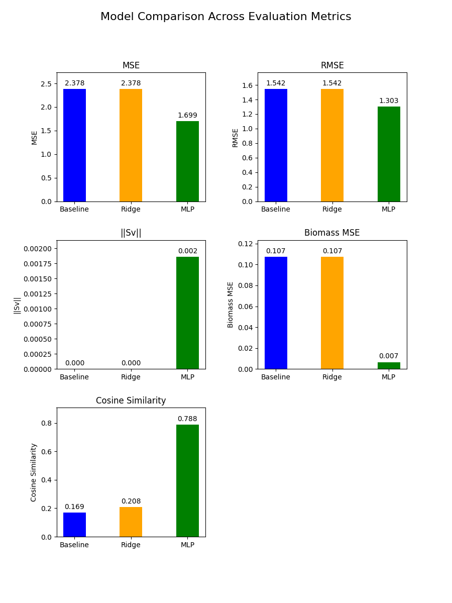
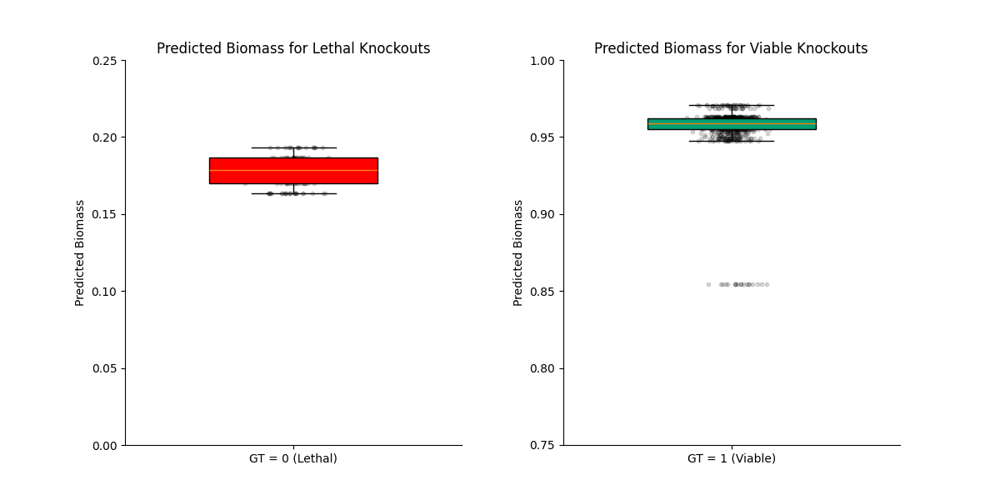
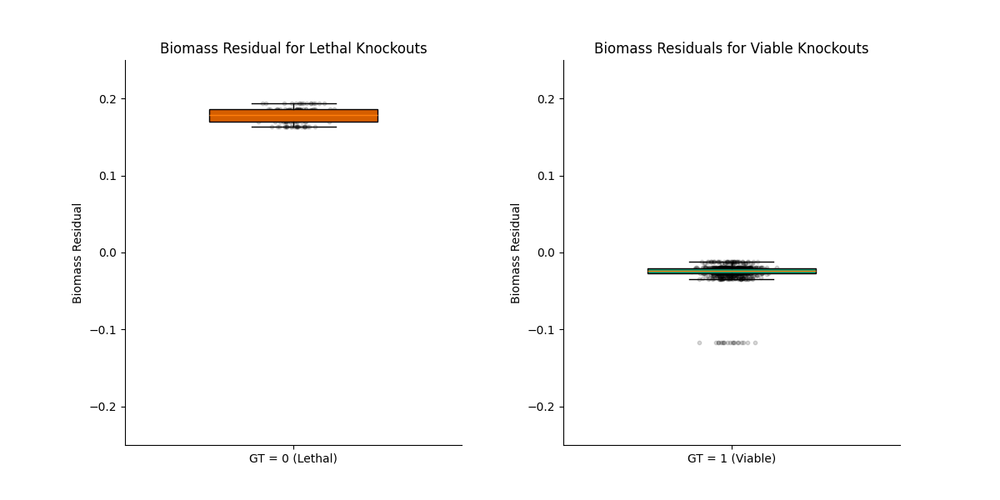
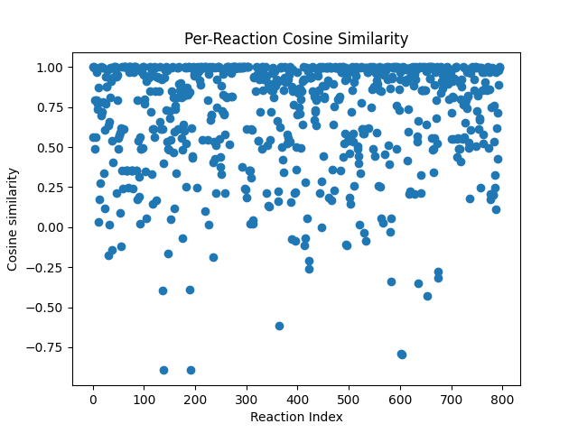
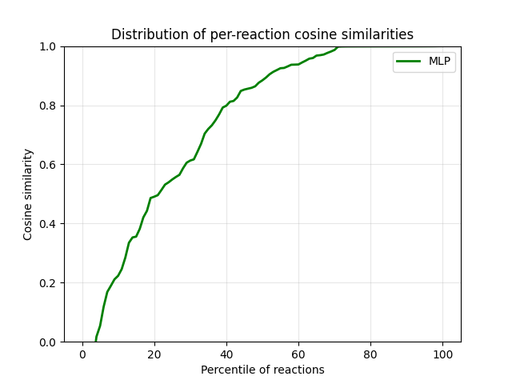
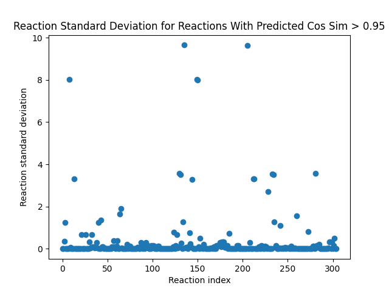

# ML Driven Flux Prediction and Growth Modeling in E. Coli

## Overview
Flux balance analysis (FBA) is a mathematical approach to simulating the flow of metabolites through metabolic networks. The metabolic network is modeled as a set of reactions and metabolites, and FBA predicts a flux distribution for each reaction. 

Genes encode enzymes which catalyze metabolic reactions. This project aims to simulate the effect of gene knockouts on the entire flux state. Specifically, we formulate FBA as an optimization problem which we try to solve via gradient descent.

The objective is formulated as max_v {cv} subject to Sv = 0

* S is the stoichiometric matrix (rows = metabolites, columns = fluxes)
* v is a vector of fluxes per reaction
* c is a one-hot vector which selects the biomass (growth) reaction from the set of all reactions. (The vector is all 0s except at the biomass reaction, where it is 1).

What this means is that we want to find the complete set of fluxes which maximizes the growth (via the biomass flux) subject to Sv=0, which is a biological feasibility constraint.

There are 2 Jupyter Notebooks included in this repository. The first, 'basic_fba.ipynb' simply works with cobrapy built in functions to build intuition and learn the problem setup. The second, 'FBA_MLP.ipynb', contains the ML experiment described above. Flux train set statistics (see the Data section for how these are computed) used to standardize fluxes are included in the 'flux_train_set_stats' directory for single and double gene knockouts.

## Data and Preprocessing
* Basics: We load the E.Coli model that comes bundled with cobrapy ("iJ01366"). We prune unused reactions. Cobrapy is used to simulate gene knockouts via cobra.manipulation.knock_out_model_genes and obtain ground truth fluxes via model.optimize().

* **Choice of inputs**: We can use either genes or reaction bounds as inputs. Modifying the reaction bounds simulates dropping the genes. However, we found that this did not train, indicating that the gene-protein-reaction layer adds too much complexity. For the results presented here, **genes** are used as inputs, and the **fluxes** are outputs. 

* **Number of gene knockouts**: We could choose either acceptable range of gene knockouts to sample randomly from each step, or restrict predictions to a single number of gene knockouts. Initially, we attempted flux prediction with 1-3 knockout genes, but the model was not able to progress. (TODO: Investigate whether the flux distribution statistics look very different for single vs double gene knockouts). We therefore restrict the input space to only single gene knockouts. We also use only solutions with a status of 'optimal'.

* **Train-test split**: We reserve the first 50 genes for the test set, and construct a test set by randomly sampling 1000 knockouts. The remainder of the genes are eligible for knockout. During each train step, a batch of 16 random gene knockouts are simulated. Batches are computed on-the-fly, which minimizes data storage needs.

* **Output standardization**: Predicting absolute fluxes would likely destabilize training due to the long-tailed distributions and varying output ranges. We therefore scale the outputs by normalizing them relative to the mean and std dev of the reaction's flux distribution. These distributional statistics are approximated by monte carlo sampling per reaction (50k samples). This choice is because acceptable flux ranges for each reaction vary wildly, and are often long-tailed distributions. In constructing the distributional statistics, we randomly drop out a gene, and aggregate the resulting fluxes in order to find the mean and std dev over 50k samples. In choosing the genes, we restrict our choices to only the genes eligible for dropout during training (excluding those reserved for test).

* **Pruning of low-variance reactions**: We prune any reactions with a standard deviation < 1e-6. This is because when we perform standardization of fluxes, we divide by the standard deviation. We do standardization to restrict the range of the fluxes, but dividing by tiny std devs explodes this range and destabilizes training. This decision was made after observing huge spikes in training loss when pruning only reactions with std==0.

## Experimental Setup

* **Baseline:** Ridge regression (linear regression with L2 regularization) from scikit-learn was used as a baseline.

* **Model:** A simple 3-layer MLP with 256 neurons per layer is used. This allowed for training without overfitting, indicating that it had sufficient capacity.

* **Loss:** An MSE between ground truth fluxes and predicted fluxes (standardized as described in the data section) was first optimized. Once it was demonstrated that training could progress successfully, a constraint loss was added (see next point)

* **Constraint loss:** We are aiming to satisfy the constraint Sv=0 in the problem formulation, so we add a penalty term equivalent to the L2 norm of Sv', where v' is the predicted flux vector. Note that in order to compute this, we first un-normalize the predicted outputs so they are in the original flux range.

* **Metrics:** We choose 5 metrics to evaluate progress:
    * **MSE loss:** This is the easiest way to determine whether the model generalizes
    * **RMSE:** This tells us how many std deviations from the ground truth our predictions are on average. Because we standardized the output space to have a std dev of 1 and mean of 0, we can interpret RMSE in terms of std dev of the original data.
    * **L2 Norm of Sv:** Monitoring this gives us an idea of whether the model is producing feasible solutions (closer to 0 is better!)
    * **Cosine similarity:** The predicted fluxes may be more similar to the ground truth for some reactions - the error is not uniform across reactions. This gives us a more fine-grained view of how good per-reaction alignment is.
    * **Biomass MSE:** Compares the ground truth biomass flux/growht to the prediction. This tells us whether our predictions correctly model the relationship of gene knockouts to organism growth, which is often a main quantity of interest.

## Results

* Baseline #1: Ridge regression on single knockouts results in MSE, run on the 50k samples used to generate the train set statistics.
* Baseline #2: Mean train set fluxes. These are compared to eval set ground truth fluxes.

Figure 1. Metrics Comparison

| Method           | MSE   | RMSE  |\|\|Sv\|\| | Cosine similarity | Biomass MSE|
|------------------|-------|-------|-----------|-------------------|------------|
| Dumb baseline    | 2.378 | 1.542 | 2.050e-12 | 0.169             | 0.107      |
| Ridge regression | 2.378 | 1.542 | 2.852e-14 | 0.208             | 0.107      |
| MLP              | 1.699 | 1.300 | 0.002     | 0.789             | 0.007      |

The MLP significantly outperforms both baselines, indicating that the problem is nonlinear, and the mapping is learnable. Figure 2. shows a visual comparison of the metrics across the 3 models, highlighting that while the MLP violates the Sv=0 constraint, it also models the reaction fluxes better.

Figure 2.

Figure 3. and Figure 4. show the distribution of predicted biomass for lethal vs non-lethal knockouts, as well as the residuals for each. The residuals are small, and fairly consistent in both cases. The fact that the lethal residuals are positive while the non-lethal residuals are negative indicates that the model tends towards conservative prediction closer to the mean.

The predicted biomass distributions are also quite consistent, with predictions in a fairly narrow range, and no outliers straying into the wrong class.

Figure 3.

Figure 4.

Finally, Figures 5. and 6. plot cosine similarity per reaction. Figure 5. plots the cosine similarity value per reaction, while Figure 6. plots the cumulative distribution. This gives us a more fine-grained view into the uniformity of prediction accuracy, specifically allowing us to evaluate how well the MLP models the directions of flux changes in response to gene knockouts. We can notice that cosine similarity reaches 1.0 around the 75th percentile, which suggests that the MLP successfully models flux directionality across many reactions. 

Figure 7. shows the standard deviations of the 305 reactions for which the predicted cosine similarity per reaction averages >0.95 in the eval set. Most of these are low-variance, making them easy to predict, but 15 of them have a standard deviation above 2.0. The fact that such a high cosine similarity is achieved in these cases is either a bug, or an indication that the MLP is learning complex signals. It is also possible for the results to be directionally correct without the absolute scale matching, which would result in a high cosine similarity without correct absolute flux prediction. It is also important to note that the standard deviation statistics are computed based on the train set candidate knockout genes. A separate set of genes is withheld for eval. It is possible that for the genes in the eval set, the variance of the reactions is missrepresented. 

Figure 5.

Figure 6.

Figure 7.

## Future Directions

This is a highly constrained and limited setup. Possible directions to expand this experiment include:

* Multiple gene knockouts: Randomly sampling 1-3 gene knockouts and using the same distributional statistics to standardize the fluxes was not viable. However, it is possible that the distributional statistics are significantly different depending on the number of knockouts. The next step here would be to compute separate statistics for double dropouts, and try training with only double dropouts. If this succeeds, we could combine single and double dropouts, standardizing the outputs according to the correct means and std devs.

* Use a more sophisticated backbone: The MLP does not encode the structure of the metabolic network. It does not model interactions between metabolites or reactions. Using a graph neural network, or graph transformer would be an interesting direction to explore. A graph transformer would be appropriate if we expanded the problem space to multiple knockouts - it would likely be too large of a model for single gene knockouts on E.Coli only.
